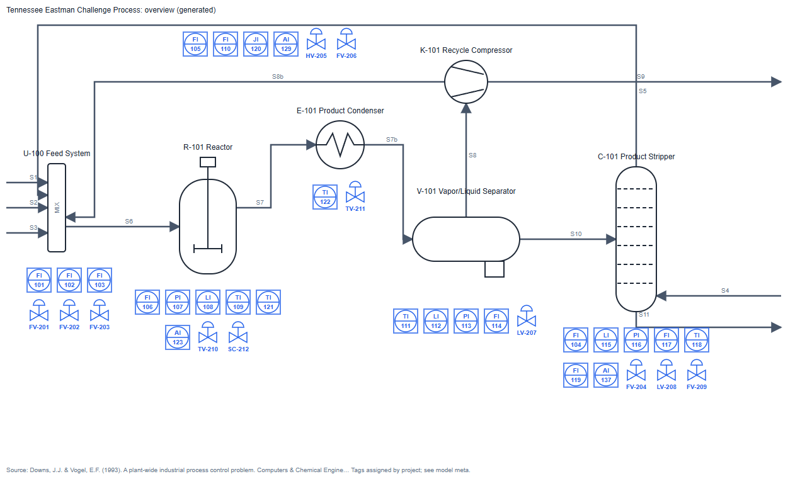

# P&ID → Digital Twin Jumpstart

Turning piping and instrumentation diagrams into a tagged asset model for Ignition and AVEVA PI with AI tools,
**and measuring whether the result can be trusted.**

The first step of most digital twin projects is someone redrawing P&IDs and typing tag lists by hand for weeks. This
project tests how much of that AI vision models can do, how to check their work honestly, and how a plant could use
the approach without compromising its safety and data governance.



---

## Results so far

Three frontier models read 12 real engineering P&IDs (the open [OPEN100](https://www.open-100.com) reactor design,
annotated in the [PID2Graph](https://zenodo.org/records/14803338) dataset). Each was scored against that
independent answer key: same images, same prompt, same scorer for every model.

| Model | Found the symbol and named it right (F1) | Connections between assets (F1) |
|---|---|---|
| GPT (gpt-6.1-sol, via Codex) | 0.85–0.87 | 0.53 |
| Claude (claude-opus-5-5) | 0.85 | 0.42 |
| Gemini (gemini-3.1-pro) | 0.44 first try → 0.74 after a format fix | 0.24 |
| Gemma 4 31B (open weights, can run offline) | 0.25 first try (5 of 12 timed out). After a retry, 9 of 12 completed at ~0.53; the same 3 dense sheets never finished | 0.02 |

**What that means in practice:**
- Instruments and off-page connectors are close to solved (0.98–0.99 for all three).
- Every model misses more than half of the process connections, so topology still needs a person.
- Gemini's first-try gap was an output-format slip: it swapped the x and y axes on 5 of 12 drawings. A one-line
  prompt change fixed it.
- Twelve drawings from one design show patterns, not a universal ranking.

Full method, run-to-run variance and caveats: **[docs/EVALUATION.md](docs/EVALUATION.md)**.

## What this project demonstrates

- **Domain to data.** P&ID conventions (ISA-5.1 tags, off-page connectors, equipment classes) turned into one
  structured model. That model generates SVG graphics, Ignition UDTs and tags, a PI AF hierarchy, and a
  plain-language review sheet for operations.
- **Evaluation you can defend.**
  - Scoring rules were written before any model ran.
  - The scorer was tested with deliberately wrong answers. Its first version gave them 15–32% credit and had to be
    rebuilt.
  - Every result is repeated to measure noise.
  - Failures count as zero.
  - Where I broke one of my own rules, the docs say so.
- **Judgment about tools.** Three cloud models compared fairly, plus an open-weight model as a stand-in for a fully
  offline deployment, with time and cost recorded per drawing.
- **Plant reality.** Every step carries an "At your plant" note covering:
  - messy drawing sets;
  - getting savings from an imperfect draft;
  - Management of Change;
  - read-only, monitoring-only use;
  - data-egress terms;
  - OT network zoning;
  - what an air-gapped model setup would cost.

## How it was built

AI coding agents (Claude Code and Codex) wrote most of the code. I set the direction, made the design decisions,
checked every result, and played the operations reviewer from my own process-plant background. The
[build journal](docs/JOURNAL.md) records each decision, what was rejected, and what went wrong, including the
agents' own mistakes and mine.

---

## Tutorial: reproduce it

Requires Python 3.10+ (standard library only). Model runs need the relevant CLI or API key; everything else runs
offline.

**1. Check the seed model against its source.** This verifies the Tennessee Eastman model against the open TE
simulation code (36 of 37 items confirmed, 1 corrected):
```
python scripts/verify_te_source.py --write
```

**2. Generate the platform outputs.** SVGs, the Ignition tag import, the PI AF sheet and the operations review sheet
go to `out/`:
```
python scripts/generate.py
```

**3. Fetch the scoring drawings.** This downloads 12 drawings and answer keys, about 20 MB, by reading only the parts
of a 9.3 GB archive that are needed:
```
python scripts/fetch_pid2graph.py --get "Complete/PID2Graph OPEN100/"
```

**4. Prove the scorer before trusting it.** Positive and negative controls must all pass:
```
python scripts/test_scorer_controls.py
```

**5. Run a model and score it.** Use `claude`, `codex`, or `gemini`; for Gemini, set `GEMINI_API_KEY`:
```
python scripts/run_extraction.py --tool gemini --drawings 0,1,2 --label my-run --prompt extraction/prompt_v2.md
python scripts/scorecard.py --label my-run
```

**6. Read why each step is done this way** in [docs/JOURNAL.md](docs/JOURNAL.md). Each entry ends with how to apply
it at a real site.

## Read next

| Document | For |
|---|---|
| [docs/EVALUATION.md](docs/EVALUATION.md) | How "done well" is defined, the anti-Goodhart rules, full results |
| [docs/JOURNAL.md](docs/JOURNAL.md) | Each step: what, how, why, lesson, and "at your plant" |
| [docs/AT_YOUR_PLANT.md](docs/AT_YOUR_PLANT.md) | Messy data, savings from imperfect drafts, safety and security, offline models and cost |
| [docs/PLAN.md](docs/PLAN.md) | Phases, decisions, risks, sources |
| [docs/TWIN_OUTPUTS.md](docs/TWIN_OUTPUTS.md) | Extracted sheets to a twin starter kit: hierarchy, Ignition, PI AF, SVG, review queue |

## Status

| Phase | State |
|---|---|
| Seed model, generator, platform outputs | Done |
| Answer keys (TE verified; OPEN100 fetched) | Done |
| Extraction comparison (3 cloud models × 3 runs, plus an open-weight model) | Done |
| Twin converter: extracted sheets to hierarchy, Ignition tags, PI Builder sheet, SVG overlays, review queue (`scripts/build_twin.py`). PI AF XML is not emitted yet: I'm not sure of its exact format, so only the PI Builder sheet is written | Done (dev set) |
| Operations review of the Tennessee Eastman extraction | Next |
| Ignition import + live values from public TE simulation data | Planned |

## Data and credits

- **PID2Graph** (Zenodo 14803338, CC BY-SA 4.0) and the **OPEN100** design by the Energy Impact Center. Downloaded by
  script, not redistributed.
- **Tennessee Eastman process**, Downs & Vogel (1993); open simulation code by the Braatz group (University of
  Illinois). Downloaded by script.
- Code in this repository: MIT.
