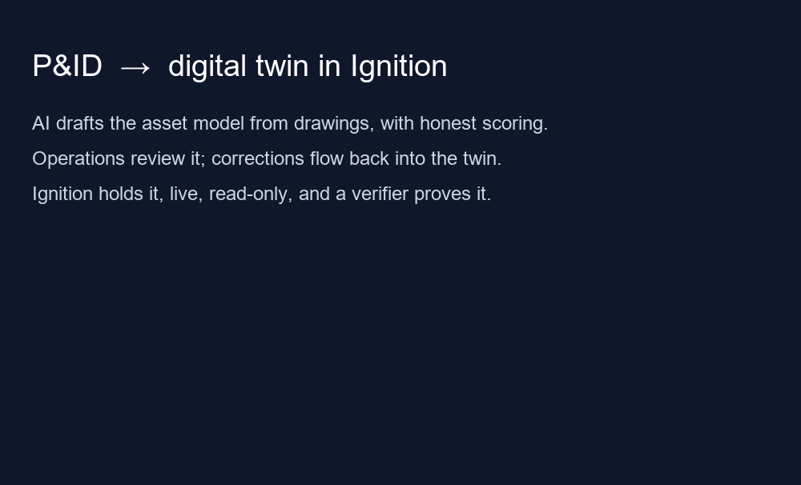
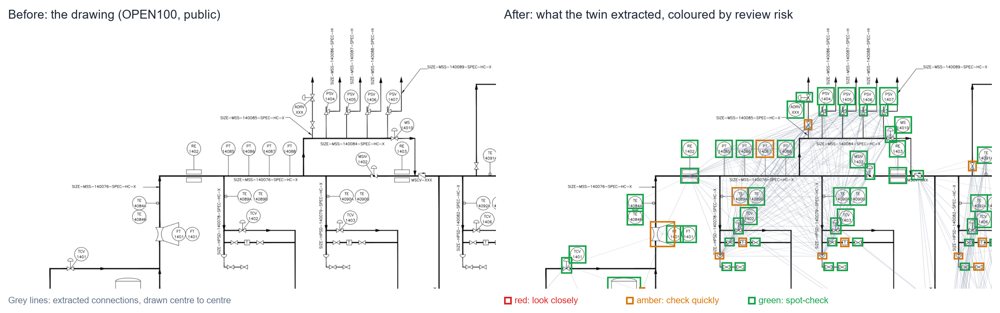
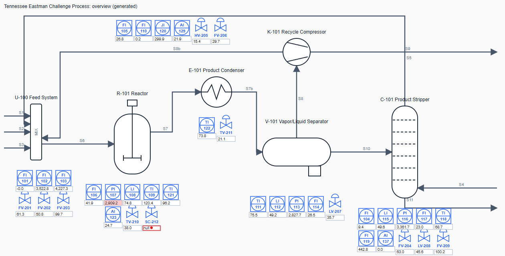
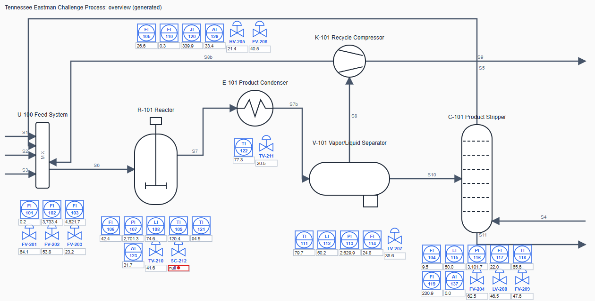
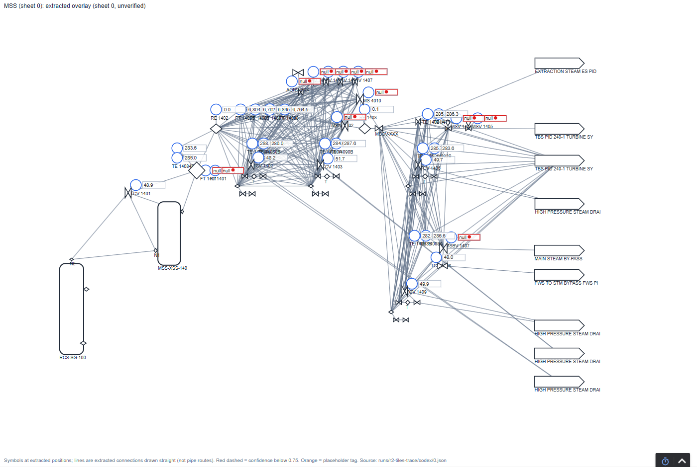

# P&ID → Digital Twin Jumpstart

[](https://github.com/steve-vitale/pid-to-digital-twin/actions/workflows/tests.yml)

Turning piping and instrumentation diagrams into a tagged asset model for Ignition and AVEVA PI with AI tools,
**and measuring whether the result can be trusted.**

The first step of most digital twin projects is someone redrawing P&IDs and typing tag lists by hand. This
project tests how much of that AI vision models can do, how to check their work honestly, and how a plant could use
the approach without compromising its safety and data governance.

**Start here:**

| You are… | Read this |
|---|---|
| **Evaluating the work** (2 minutes) | [Results](#results-so-far) and [Try it in Ignition](#try-it-in-ignition) below, then [what it cost](docs/COSTS.md). For the judgment calls, journal entries [7](docs/JOURNAL.md#7-fix-the-scoring-rules-first-then-test-the-scorer-until-it-cant-be-fooled), [13](docs/JOURNAL.md#13-round-3-results-a-review-queue-that-points-people-at-the-problems-and-a-fix-that-only-half-generalized) and [14](docs/JOURNAL.md#14-the-ignition-build-the-twin-in-a-real-gateway-judged-by-the-gateway) |
| **Someone who wants to see it run, with no setup** | [The one-click demo](docker/README.md): install Docker Desktop, double-click `start-demo.bat` |
| **An Ignition user who wants to see it run** | [Load the twin into your own Ignition](docs/IGNITION_QUICKSTART.md) (about 15 minutes, free trial) |
| **Planning something like this at a plant** | [At your plant](docs/AT_YOUR_PLANT.md), [From demo to a real site](docs/FROM_DEMO_TO_A_REAL_SITE.md), [Costs](docs/COSTS.md) |
| **Checking or reproducing the numbers** | [Tutorial](#tutorial-reproduce-it), [How "done well" is defined](docs/EVALUATION.md), [Pre-registered goal and results](docs/GOAL.md) |

**Contents:** [Results](#results-so-far) · [Try it in Ignition](#try-it-in-ignition) ·
[What this demonstrates](#what-this-project-demonstrates) · [How it was built](#how-it-was-built) ·
[Tutorial](#tutorial-reproduce-it) · [Repository map](#repository-map) · [Read next](#read-next) · [Status](#status) ·
[Data and credits](#data-and-credits) · [Environment variables](#environment-variables)



*30 seconds: the drawing → what the twin extracted → Ignition, live, through a fault. Made from the repo's own screens (`scripts/make_demo_gif.py`).*

---

## Results so far

The goal ([docs/GOAL.md](docs/GOAL.md)) is a digital twin starter kit that needs as little human correction as
possible. The primary score, **review load**, counts the corrections a reviewer must make per 100 items on the
drawing (lower is better).

The rules, splits and decision rule were committed before any method was tested. Each method was scored once on two
sealed sets nobody tuned on:
- **A:** 6 real OPEN100 drawings;
- **B:** 20 drawings in a different drafting style.

| Model | Baseline (whole sheet), A / B | **Tiling + line tracing**, A / B |
|---|---|---|
| GPT (gpt-6.1-sol, via Codex) | 48.8 / 67.0 | **17.8 / 20.7** |
| Claude (claude-opus-5-5) | 61.1 / 76.6 | **32.4 / 16.5** |
| Gemini (gemini-3.1-pro) | 75.9 / 92.7 | **40.2 / 38.3** |



**What that means:**
- **AI reads symbols and tags; code traces the lines.** Connections are two-thirds of the work and the models'
  weakest skill. A deterministic line tracer took the best result from about 49 corrections per 100 items to about
  18.
- **It held on a different drafting style,** so it isn't tuned to one drawing set.
- **Not everything improved.** Choosing the right parent equipment for each instrument got slightly worse (90.9% →
  87.0%), because the tracer links everything on a shared pipe network. Round 3 fixed it for this drafting style
  (next bullet but one).
- **Reviewers get a risk-ranked queue.** Every item has a green / amber / red tier and a plain-language reason. For
  example, the twin built from 12 sheets has 377 red, 676 amber and 1,833 green items out of 2,886. On drawings
  nobody tuned on, the riskiest 20% held 2–4× as many errors as the models' own confidence would point to (23 of 24
  comparisons), and green items were 94–100% right. The one failure was the best model with the best method on
  same-style drawings, where it was no better than the model's own confidence. That's reported in
  [GOAL.md](docs/GOAL.md).
- **Instrument-to-equipment assignment is fixed for this drafting style** (92.2%, up from 87.0%) by following the
  drawn line. On a different style it slipped (67.6% vs 70.8%), so the two rules' disagreements go to review.
- **An open-weight model you can run offline** (Gemma 4 31B, round 1) trailed far behind: about 0.53 detection F1
  where it finished, and it stalled on dense sheets.
- **It runs in a real Ignition gateway, judged by the gateway.** The Tennessee Eastman plant is live from open
  simulation data, with alarms. The 12-sheet extracted twin is honestly "not connected", and every drawing has a
  Perspective screen.
  - A verifier runs nine checks against the running gateway. Among them: the gateway holds exactly what was sent, no
    tag without a source ever reads Good, outside writes are refused, and the reactor pressure alarm fires on a
    replayed fault.
  - Before its passes counted, it had to catch five faults planted on purpose. It caught all five, and all nine
    checks pass. See [docs/IGNITION_BUILD.md](docs/IGNITION_BUILD.md).
- **Operations corrections flow back into the twin.** The reviewer fills in a spreadsheet: confirm, correct or
  reject, show on screen, alarm priority. A script checks every row, applies the decisions with a change record, and
  regenerates Ignition, PI AF and the screens. Removing or inventing an alarm is routed to a change review instead
  of being applied. See [docs/REVIEW_LOOP.md](docs/REVIEW_LOOP.md).
- **Placeholders become live points from an I/O list.** Matching never guesses. It also lists the points a plant
  has that the drawing doesn't show, the first sign of an out-of-date drawing. In the demo (a labeled synthetic I/O
  list), 24 mapped instruments read live in Ignition while the rest stay honestly "not connected".
- **Old scans: where it breaks** (round 4, pre-registered). Photocopy quality made no consistent difference. On
  old-scan quality, review load roughly tripled (GPT 17.8 → 51.5); on a bad scan it quadrupled (72.6). Most of the
  loss is the code line tracer, not the models: their symbol reading fell gently, and tracing the same symbols on
  the clean image recovers much of the connection score. An archive of scans needs image cleanup before tracing.
  Details in [GOAL.md](docs/GOAL.md), round 4.



## Try it in Ignition

The twin runs in Ignition 8.3, and you can load it into your own gateway from committed files. You need:
- a tag import ([`twin_provider.json`](out/ignition/gateway/twin_provider.json));
- a Perspective project ([`PIDTwin.zip`](out/ignition/gateway/PIDTwin.zip));
- the small replay server that feeds the live values ([`te_sim_server.py`](scripts/ignition/te_sim_server.py)).

A gateway assembled that way, by hand through the web UI plus one tag import, passed all nine verifier checks. Steps:
**[docs/IGNITION_QUICKSTART.md](docs/IGNITION_QUICKSTART.md)**. To do the same thing by script with every check,
see [docs/IGNITION_BUILD.md](docs/IGNITION_BUILD.md).

| Live overview | Fault 6: reactor pressure alarm | An extracted sheet, honestly not connected |
|---|---|---|
|  |  |  |

**Three ways to run it:**
- **No setup:** [the one-click demo](docker/README.md). Install Docker Desktop, then double-click `start-demo.bat`;
  the screen opens in your browser. It's checked from scratch on GitHub's machines whenever it changes.
- **Your own Ignition:** [the 15-minute quickstart](docs/IGNITION_QUICKSTART.md), by hand through the web UI.
- **Scripted, with every check:** [docs/IGNITION_BUILD.md](docs/IGNITION_BUILD.md).

There's no public live instance. It runs on your own computer, and Ignition's free trial is enough. With the
gateway's settings in place, one command fetches the data, builds and verifies the twin, and keeps it live:
`python scripts/demo.py --build --verify`.

**What it cost:** $16.57 of metered model spend (a $25 cap), plus two flat-rate subscriptions. Machine time is
cents per sheet; reviewer time is the real cost, and the docs show how to size it. See [docs/COSTS.md](docs/COSTS.md).

Full results, every method tried (including the losses), and caveats: [docs/GOAL.md](docs/GOAL.md) →
Results, and [docs/EVALUATION.md](docs/EVALUATION.md).

## What this project demonstrates

- **Domain to data.** P&ID conventions (ISA-5.1 tags, off-page connectors, equipment classes) turned into one
  structured model. That model generates SVG graphics, Ignition UDTs and tags, a PI AF hierarchy, and a
  plain-language review sheet for operations.
- **Evaluation you can defend.**
  - Scoring rules were written before any model ran.
  - The scorer was tested with deliberately wrong answers. Its first version gave them 15–32% credit and had to be
    rebuilt.
  - Every result is repeated to measure noise.
  - Failures count as zero.
  - Where I broke one of my own rules, the docs say so.
- **Judgment about tools.** Three cloud models compared fairly, plus an open-weight model as a stand-in for a fully
  offline deployment, with time and cost recorded per drawing.
- **Plant reality.** Every step carries an "At your plant" note covering:
  - messy drawing sets;
  - getting savings from an imperfect draft;
  - Management of Change;
  - read-only, monitoring-only use;
  - data-egress terms;
  - OT network zoning;
  - what an air-gapped model setup would cost.

## How it was built

AI coding agents (Claude Code and Codex) wrote most of the code. I set the direction, made the design decisions,
and checked every result. No operations review of the Tennessee Eastman model has been done yet: the tooling for it is built and tested, but a review only counts if it comes from someone who knows the process and is looking at the drawings. The
[build journal](docs/JOURNAL.md) records each decision, what was rejected, and what went wrong, including the
agents' own mistakes and mine.

---

## Tutorial: reproduce it

Requires Python 3.10+. Steps 1–2 use the standard library only; the rest need `pip install -r requirements.txt`.
Model runs need the relevant CLI or API key; everything else runs offline.

**1. Check the seed model against its source.** This verifies the Tennessee Eastman model against the open TE
simulation code (36 of 37 items confirmed, 1 corrected):
```
python scripts/verify_te_source.py --write
```

**2. Generate the platform outputs.** SVGs, the Ignition tag import, the PI AF sheet and the operations review sheet
go to `out/`:
```
python scripts/generate.py
```

**3. Fetch the scoring drawings.** This downloads 12 drawings and answer keys, about 20 MB, by reading only the parts
of a 9.3 GB archive that are needed:
```
python scripts/fetch_pid2graph.py --get "Complete/PID2Graph OPEN100/"
```

**4. Prove the scorer before trusting it.** Positive and negative controls must all pass. `run_tests.py` runs every
test (the same command CI runs):
```
python scripts/test_scorer_controls.py
python scripts/run_tests.py
```

**5. Run a model and score it.** Use `claude`, `codex`, or `gemini`; for Gemini, set `GEMINI_API_KEY`:
```
python scripts/run_extraction.py --tool gemini --drawings 0,1,2 --label my-run --prompt extraction/prompt_v2.md
python scripts/scorecard.py --label my-run
```

**6. Trace the connections with code and build the digital twin starter kit:**
```
python scripts/trace_connections.py --src-label my-run --tool gemini --drawings 0,1,2 --label my-run-traced
python scripts/build_twin.py --label runs/my-run-traced/gemini/ --sheets 0,1,2 --score
```
The twin package lands in `out/twin/`: asset hierarchy, review queue, Ignition tags, PI AF rows, and per-sheet SVGs.
See [docs/TWIN_OUTPUTS.md](docs/TWIN_OUTPUTS.md).

**7. Build it into Ignition and verify it** (needs an Ignition 8.3 gateway; the free trial works). The build
script takes a backup, then creates the replay connection, tag provider, tags and screens. The verifier plants five
faults, confirms each is caught, restores the gateway, then runs all nine checks:
```
python scripts/fetch_te_data.py                      # the open TE simulation runs the replay uses
python scripts/ignition/build_gateway.py --fresh
python scripts/ignition/te_sim_server.py --run normal   # live values for the screens (leave running)
python scripts/ignition/verify_gateway.py --controls   # stop the replay first: the verifier drives it itself
```
Setup (API key, HTTPS, OPC UA certificate) is in [docs/IGNITION_BUILD.md](docs/IGNITION_BUILD.md). To just
load the committed kit by hand, use [docs/IGNITION_QUICKSTART.md](docs/IGNITION_QUICKSTART.md).

**8. Close the loop: operations review and real data points.** Apply a filled-in review sheet, map instruments
from an I/O list, then regenerate and rebuild (details in [docs/REVIEW_LOOP.md](docs/REVIEW_LOOP.md)):
```
python scripts/apply_review.py data/te_process_model.json reviewed.csv --reviewer "Name, role"
python scripts/map_points.py out/twin/r2-tiles-trace/codex/plant_model.json data/io_lists/open100_sheet0_demo.csv --sheets 0
python scripts/generate.py && python scripts/generate.py out/twin/r2-tiles-trace/codex/plant_model.json
python scripts/demo.py --build --verify       # one command: data, build, nine checks, then live
```

**9. Read why each step is done this way** in [docs/JOURNAL.md](docs/JOURNAL.md). Each entry ends with how to apply
it at a real site.

## Repository map

| Path | What's there |
|---|---|
| [`docs/`](docs/) | Everything to read; see [Read next](#read-next). Screenshots are in [`docs/screenshots/`](docs/screenshots/) |
| [`data/te_process_model.json`](data/te_process_model.json) | The Tennessee Eastman seed model, checked against the simulator source |
| [`data/sheet_registers/`](data/sheet_registers/) | A drawing index read from the OPEN100 title blocks (an example of what a plant supplies) |
| [`data/io_lists/`](data/io_lists/README.md) | A synthetic I/O list for the point-mapping demo, shaped like a real export |
| [`extraction/`](extraction/) | The prompts every model got (`prompt_v2.md` is current), hashed into every run record |
| [`scripts/`](scripts/) **, by stage** | |
| · source and data | `verify_te_source.py`, `fetch_te_data.py`, `fetch_pid2graph.py` |
| · extraction | `run_extraction.py` (Claude / Codex / Gemini adapters, cost meter, spend cap), `tiling.py`, `remerge_tiles.py` |
| · line tracing (code, no AI) | `trace_connections.py` |
| · scoring | `score_pid2graph.py` (the frozen scorer), `scorecard.py`, `per_drawing.py`, `score_twin.py`, `score_triage.py` |
| · the twin | `build_twin.py` (sheets to hierarchy, review queue, platform files), `confidence.py` + `confidence_model.json` (risk tiers), `generate.py` (SVG, Ignition, PI AF, review sheet) |
| · review loop | `apply_review.py` (operations decisions back into the model), `map_points.py` (I/O list to data addresses) |
| · scans (round 4) | `degrade_scans.py` (geometry-preserving old-scan images), `run_scan_robustness.ps1`, `score_scan_robustness.ps1` |
| · demo | `demo.py` (one command to a live twin), `make_before_after.py`, `make_demo_gif.py` |
| · Ignition | [`scripts/ignition/`](scripts/ignition/): `build_gateway.py`, `build_views.py`, `import_tags.py`, `te_sim_server.py`, `demo_points_server.py`, `verify_gateway.py`, `ua_client.py`, `gw.py`, `make_local_ca.py` |
| · tests and costs | `run_tests.py` (all tests; CI runs it), `test_*.py`, `cost_report.py`; `*.ps1` reproduce the holdout tables on Windows |
| [`out/`](out/) | Committed results: `scorecard_<label>.md`, [`costs.md`](out/costs.md), the TE outputs (`svg/`, `ignition/`, `pi/`, `ops_review_sheet.csv`) |
| [`out/twin/r2-tiles-trace/codex/`](out/twin/r2-tiles-trace/codex/) | The 12-sheet extracted twin: `plant_model.json`, `review_queue.csv` (risk-tiered), Ignition tags, PI AF sheet, per-sheet SVGs |
| [`out/ignition/gateway/`](out/ignition/gateway/) | The Ignition kit (tag import, Perspective project) and dated verification receipts in `receipts/` |
| [`out/mapping/`](out/mapping/), `out/review/` | Point-mapping reports, and the change records each applied review writes |
| [`docker/`](docker/README.md), `docker-compose.yml`, `*-demo.bat` | The one-click demo: Ignition restored from a prepared backup, plus the two data servers, and the double-click launchers |
| [`runs/`](runs/README.md) | Raw model run records (not committed) and the Gemini spend ledger (committed) |
| [`NOTICE.md`](NOTICE.md), [`LICENSE`](LICENSE), [`CITATION.cff`](CITATION.cff) | Licensing (MIT code; CC BY-SA for files derived from PID2Graph) and how to cite |

## Read next

| Document | For |
|---|---|
| [docs/GOAL.md](docs/GOAL.md) | The round-2 goal, review-load score, sealed splits, decision rule, and results |
| [docs/EVALUATION.md](docs/EVALUATION.md) | How "done well" is defined, the anti-Goodhart rules, round-1 results |
| [docs/FROM_DEMO_TO_A_REAL_SITE.md](docs/FROM_DEMO_TO_A_REAL_SITE.md) | What it takes to go from a clean annotated set to a 40-year drawing archive |
| [docs/TWIN_OUTPUTS.md](docs/TWIN_OUTPUTS.md) | The digital twin starter kit: each output file and how to load it into Ignition and PI AF |
| [docs/COSTS.md](docs/COSTS.md) | What it cost, per drawing and in total, and how to size it for 1,000 sheets |
| [docs/REVIEW_LOOP.md](docs/REVIEW_LOOP.md) | Operations review back into the twin, and mapping instruments to live data points |
| [docs/IGNITION_QUICKSTART.md](docs/IGNITION_QUICKSTART.md) | Load the committed twin into your own Ignition, by hand, in about 15 minutes |
| [docs/IGNITION_BUILD.md](docs/IGNITION_BUILD.md) | The twin in a running Ignition gateway: the nine checks, planted faults, results, security |
| [docs/JOURNAL.md](docs/JOURNAL.md) | Each step: what, how, why, lesson, and "at your plant" |
| [docs/AT_YOUR_PLANT.md](docs/AT_YOUR_PLANT.md) | Messy data, savings from imperfect drafts, safety and security, offline models and cost |
| [docs/PLAN.md](docs/PLAN.md) | Phases, decisions, risks, sources, and a dated status of what changed |

## Status

| Phase | State |
|---|---|
| Seed model, generator, platform outputs | Done |
| Answer keys (TE verified; OPEN100 fetched) | Done |
| Extraction comparison (3 cloud models × 3 runs, plus an open-weight model) | Done |
| Round 2: tiling, computer-vision line tracing, extraction-to-twin converter, scored on sealed holdouts | Done |
| Round 3: risk-tiered review queue; instrument parents chosen along the traced line | Done (one partial result, reported) |
| Ignition build: live TE values and alarms, extracted twin as placeholders, Perspective screens, 9-check verifier with 5 planted faults | Done; also verified when loaded by hand ([quickstart](docs/IGNITION_QUICKSTART.md)) |
| Review loop and point mapping: decisions and data addresses flow into Ignition, PI AF and the screens | Done; verified in a running gateway |
| Round 4: robustness on old-scan images, pre-registered | Done (measured; where it breaks is reported) |
| One-click Docker demo (`start-demo.bat`), checked from scratch in CI | Done |
| Demo animation and before/after image | Done ([docs/demo.gif](docs/demo.gif)); a narrated video isn't made |
| Twin converter: extracted sheets to hierarchy, Ignition tags, PI Builder sheet, SVG overlays, review queue (`scripts/build_twin.py`) | Done |
| PI AF: asset structure as a PI Builder sheet; not imported into a PI System, by decision (below) | Scoped |
| Operations review of the Tennessee Eastman model | Tooling done and tested; the review itself is not done. It needs someone who knows the process, working from the drawings |

**PI is scoped to the asset structure, by decision.** The twin produces a PI AF hierarchy as a PI Builder sheet
(elements, templates, attributes with point references), but it has not been imported into a PI System. Why:
- **No free PI environment exists.** The 45-day developer trial is a full Windows Server install behind an account.
- **The asset structure is PI's transferable value.** PI Vision dropped plain custom-SVG import, so the graphics
  story belongs to Ignition here.
- **Ignition proves the same model end to end:** import, live values, alarms, verification.

To validate at a site, publish the sheet to a development AF database with PI Builder, check the hierarchy in PI
System Explorer, then bind the attributes to real PI points (the same I/O-list step as
[REVIEW_LOOP.md](docs/REVIEW_LOOP.md)).

## Data and credits

- **PID2Graph** (Zenodo 14803338, CC BY-SA 4.0) and the **OPEN100** design by the Energy Impact Center. Downloaded by
  script, not redistributed.
- **Tennessee Eastman process**, Downs & Vogel (1993); open simulation code by the Braatz group (University of
  Illinois). Downloaded by script.
- Code in this repository: MIT. Files derived from PID2Graph are CC BY-SA 4.0; see [NOTICE.md](NOTICE.md).

## Environment variables

| Variable | Used by | What |
|---|---|---|
| `GEMINI_API_KEY` or `GEMINI_KEY_ENV_FILE` | `run_extraction.py --tool gemini` | The key, or a path to a private `.env` file holding it |
| `PID2GRAPH_SET` | extraction, scoring, twin scripts | `Dataset PID` selects the holdout-B set; the default is OPEN100 |
| `IGNITION_ENV_FILE` | `scripts/ignition/*` | A private file of the variables below, as `KEY=VALUE` lines |
| `IGNITION_URL`, `IGNITION_API_TOKEN`, `IGNITION_CA_FILE` | `scripts/ignition/gw.py` | Gateway HTTPS address, API key, and the CA that signed the gateway's certificate |
| `IGNITION_BACKUP_DIR`, `IGNITION_SECRETS_DIR` | `build_gateway.py`, `verify_gateway.py`, `ua_client.py` | Private folders for gateway backups, the OPC UA client certificate and the verifier's OPC UA login |
| `IGNITION_UA_URL` | `ua_client.py` | The gateway's OPC UA server (default `opc.tcp://localhost:62541`) |

Keep every one of these outside the repo.
