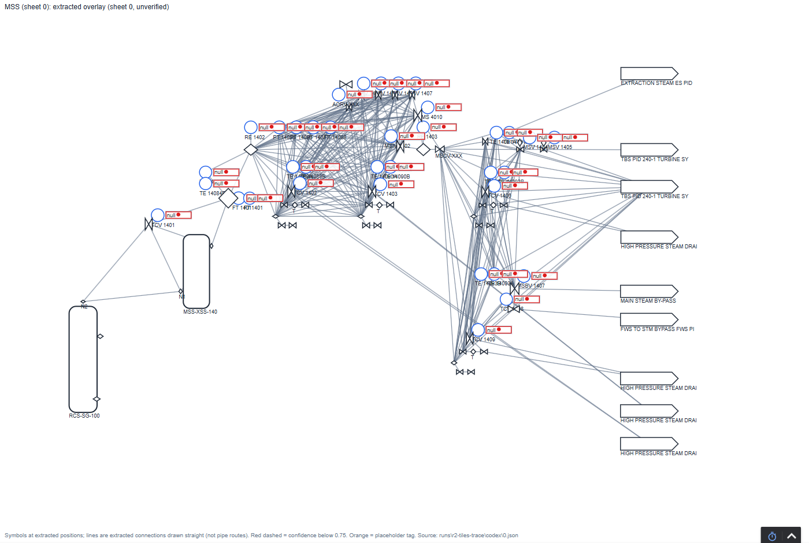

# Load the twin into your own Ignition (about 15 minutes)

What you get: a live Tennessee Eastman overview screen whose reactor-pressure alarm fires on a replayed fault, plus
12 extracted P&ID sheets as screens showing honestly that nothing behind them is connected yet. Everything comes
from files committed in this repo. There's no public live demo: it runs on your own gateway, and the free trial is
enough.

**Tested on 2026-10-08:** a gateway assembled exactly this way, through the web UI plus one tag import, then passed
all nine verifier checks, including the fault alarm (receipt `out/ignition/gateway/receipts/20261008T163955Z.md`).
Tested on Ignition 8.3.10 only.

## What's in the kit

| File | What it is |
|---|---|
| [`out/ignition/gateway/twin_provider.json`](../out/ignition/gateway/twin_provider.json) | Tag import: UDT types, the TE plant (37 instruments and valves, engineering ranges, alarms), and the 910 extracted OPEN100 assets as placeholders |
| [`out/ignition/gateway/PIDTwin.zip`](../out/ignition/gateway/PIDTwin.zip) | Perspective project: the TE overview, plus one screen per extracted sheet (`OPEN100/Sheet_0` … `Sheet_11`) |
| [`scripts/ignition/te_sim_server.py`](../scripts/ignition/te_sim_server.py) | Small OPC UA server replaying the open TE simulation data, read-only, standing in for a plant's PLC/OPC server |
| [`scripts/fetch_te_data.py`](../scripts/fetch_te_data.py) | Downloads the two TE runs it replays (normal operation and fault 6), with checksums |

`out/ignition/te_tags.json` is a different, older file: the generic generator export, not wired to the replay. Use
`twin_provider.json`.

## Steps

**0. Prerequisites:**
- Ignition 8.3 installed and commissioned (the trial is fine).
- Python 3.10+ and this repo:
  ```
  pip install -r requirements.txt
  python scripts/fetch_te_data.py
  python scripts/ignition/te_sim_server.py --run normal      # leave this running
  ```

**1. Tag provider.** In the gateway web UI, go to **Services → Tags → Create Tag Provider → Standard Tag Provider**.
Name it **`Twin`**, exactly. The screens and alarm expressions refer to `[Twin]`.

**2. OPC connection.** Go to **Connections → OPC Connections → Create Connection → OPC UA Connection**:
- discovery URL `opc.tcp://localhost:4841/te-sim`;
- pick the endpoint with security policy **None** (lab only: the replay server has no encryption);
- name it **`TE-Sim`**, exactly. The tags refer to it by name;
- tick **Read-Only**, and set **Authentication** to **Anonymous**.

It should show **CONNECTED**.

**3. Screens.** Go to **Platform → Projects → Import Project**, choose `out/ignition/gateway/PIDTwin.zip`, and name it
**`PIDTwin`**.

**4. Tags.** Import `out/ignition/gateway/twin_provider.json` into the `Twin` provider, either way:
- **Designer:** Tag Browser → choose the `Twin` provider → Import Tags → the JSON file. This is standard Ignition,
  not the path tested here.
- **REST API (tested):** create an API key (Platform → Security → API Keys), then:
  ```
  python scripts/ignition/import_tags.py out/ignition/gateway/twin_provider.json --provider Twin
  ```
  The settings it reads are in `scripts/ignition/gw.py`. API keys only work over HTTPS by default; see
  [IGNITION_BUILD.md](IGNITION_BUILD.md) for the local-CA setup used here.

Expect 1,093 tags imported, 0 failures.

**5. Look at it.**
- TE overview: `http://localhost:8088/data/perspective/client/PIDTwin`. Values change about once a second.
- Extracted sheets: `…/client/PIDTwin/open100/0` through `/open100/11`. Every instrument shows Ignition's
  bad-quality overlay and no value, which is the honest state for placeholders.

**Optional: the mapped demo points.** Start `python scripts/ignition/demo_points_server.py` (synthetic values) and
add a second OPC UA connection the same way as step 2: discovery URL `opc.tcp://localhost:4842/open100-demo`, name
**`OPEN100-Demo`**, read-only, anonymous. Sheet 0 then shows 24 live values among its placeholders. This step was
tested through the scripted build, not by hand.

**6. Trip the alarm.** Stop the replay (Ctrl+C) and start the fault case near the point where pressure climbs:
```
python scripts/ignition/te_sim_server.py --run fault6 --start 240
```
Within about 20–30 seconds, reactor pressure (PI-107) passes 2,895 kPa and its label turns red. A-feed flow (FI-101)
drops to zero, because fault 6 is the loss of A feed.

| Normal | Fault 6 | An extracted sheet |
|---|---|---|
|  |  |  |

## Optional: verify it the way this repo does

`scripts/ignition/verify_gateway.py` runs the nine checks against your gateway. They include: what it holds matches
the files, no tag without a source reads Good, outside writes are refused, and the alarm fires on the fault replay.
It needs a little more setup:
- an API key;
- a dedicated OPC UA user (created by `build_gateway.py`);
- an approved client certificate (`python scripts/ignition/ua_client.py` prints the fingerprint to approve).

All of it is in [IGNITION_BUILD.md](IGNITION_BUILD.md). Or let `scripts/ignition/build_gateway.py --fresh` do steps
1–4 for you. With those settings in place, `python scripts/demo.py --build --verify` does everything in one command:
data, build, the nine checks, then both data servers live until Ctrl+C.

## Good to know

- **Names matter:** the provider `Twin`, the connection `TE-Sim`, and the replay on port 4841.
- **Read-only, three ways:** the replay server refuses writes, the connection is read-only, and every process tag is
  read-only. The extracted twin's `ReviewStatus` fields are review workflow and stay writable.
- **Engineering ranges** on non-percentage TE tags are labeled ASSUMED in each tag's documentation (0 to twice the
  normal-run mean). No published instrument spans exist for this process.
- **Lab setup only.** At a plant, the device connection would use the site's certificates and live in its own
  network zone. See [AT_YOUR_PLANT.md](AT_YOUR_PLANT.md) §5.
