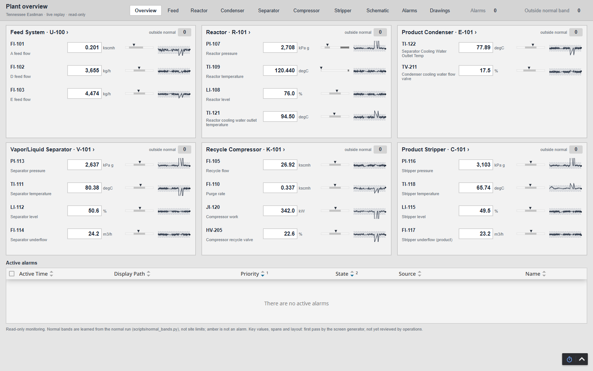
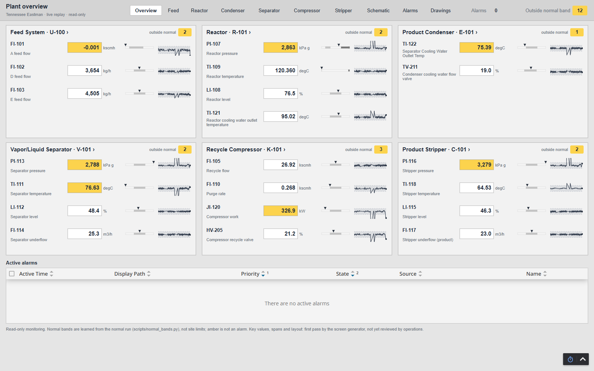
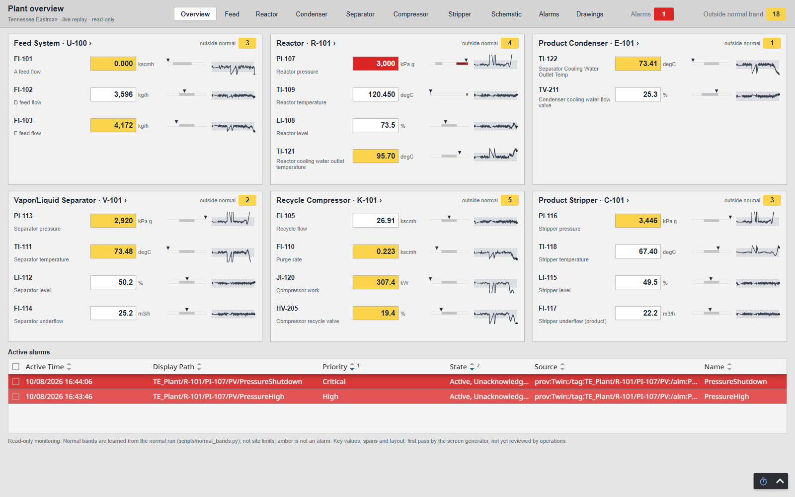
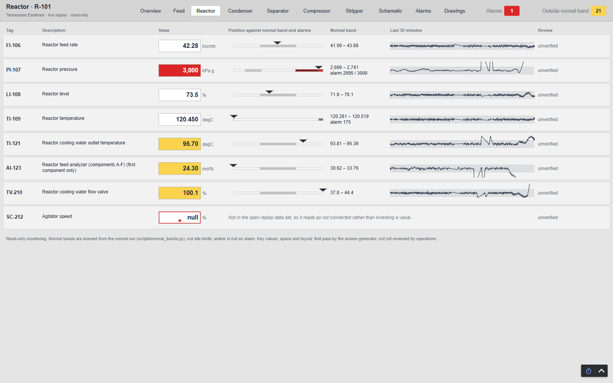
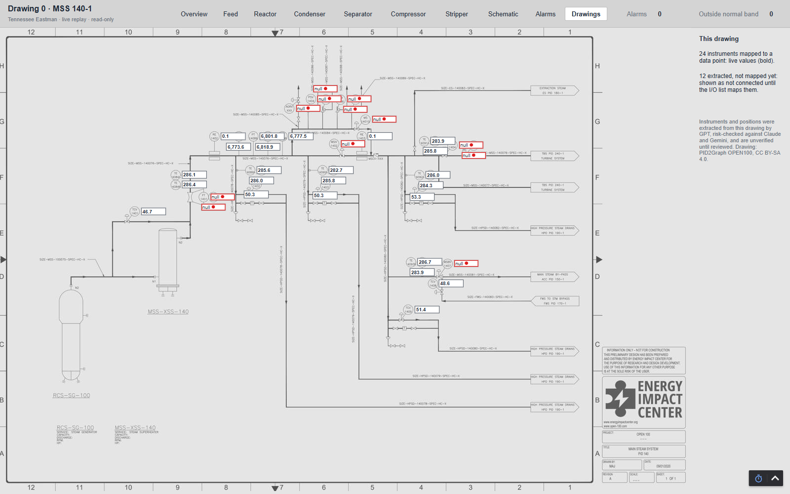

# Operator screens: what a first pass can infer

The first Ignition screens were the drawing with a value label on each instrument: correct, verified, and close to
useless for running a plant. A screen like that shows every number with the same weight and says nothing about
whether a number is good. These screens are a first pass at what an operator actually needs, generated from the
twin with no hand drawing, in the ISA-101 style: **grey and calm when the plant is normal, so colour means something
when it isn't.**

| Normal running | Fault 6, early: values leave their normal band | Fault 6: the pressure alarm |
|---|---|---|
|  |  |  |

## The screens

| Page | What it is for |
|---|---|
| `/` Plant overview (level 1) | Is anything wrong, and where? One tile per unit in process order, 2–4 key values each, with a moving analog indicator (where the value sits against its normal band and alarm limits) and a 10-minute trend. Active alarms at the bottom |
| `/unit/<id>` Unit screens (level 2) | Every value in the unit: indicator, normal band and alarm limits written out, 30-minute trend, review status. A value with no data source says so instead of showing a number |
| `/schematic` | The process schematic with live values (the original screen) |
| `/alarms` | The full alarm list, with acknowledged and cleared alarms |
| `/drawings`, `/open100/<n>` | The 12 extracted drawings as thumbnails; each opens the **original** drawing, greyed, with a live value beside every extracted instrument. Mapped instruments read live; the rest show as not connected |

Every page has the same bar: navigation, the number of values in alarm, and the number outside their normal band.

## What it infers, and how much to trust each part

**1. A normal operating band for every value. Data, no model.** An alarm limit says when it's too late; a band
says "this isn't what normal looks like". There are no published operating envelopes for Tennessee Eastman, so the
band is learned from the published normal run (`scripts/normal_bands.py`):
- **Fit** on the first half of the normal run: mean ± K standard deviations.
- **K is chosen on the second half,** which the fit never saw: the smallest K with fewer than 0.5% false flags on
  every tag. That's K = 6. At K = 3, some value would be amber in more than a quarter of normal samples (26.7%);
  operators would learn to ignore the colour within a shift.
- **Then the fault run, which chose nothing.** Fault 6 (the A feed is lost) starts at sample 160. The A feed leaves
  its band in the same sample; the reactor pressure alarm comes 98 samples later. **That's 294 minutes of plant
  time between the first amber and the first red**, and nothing was flagged in the 8 hours before the fault.
  Full table: [`out/ignition/normal_bands.md`](../out/ignition/normal_bands.md).

How much to trust it:
- **Fault 6 is an easy fault**: a feed going to zero. A slow drift would be caught later, or not at all, by a band
  this wide. One fault is a demonstration, not a detection rate.
- **The bands assume one operating mode.** The stripper steam flow and temperature drift slowly even in the normal
  run (they are the worst tags at K = 3–5). A real plant has several modes (rates, grades, startup) and needs a band
  per mode, refitted when the process changes.
- **Amber is a display aid, never an alarm.** Alarms stay the published setpoints. Adding an alarm is a change
  review, not a screen setting.

**2. Which values matter for each unit. Judgement, Claude only.** The overview shows 2–4 values per unit, chosen by
Claude (the coding agent) with one rule: the values that say whether the unit is doing its job and is safe, pressure
and temperature first where a shutdown limit exists. It's a reasonable first pass and the most obvious thing for an
operator to change. It has not been compared with another model or reviewed by operations. The list is one Python
dict (`KEY_VALUES` in `scripts/ignition/build_hmi.py`).

**3. Display spans. Judgement, Claude only.** Indicators span the normal band widened 2.5× plus any alarm limit;
trends span the band only, so a distant shutdown limit doesn't flatten them. A site would use instrument spans.

**4. What's on the drawings. Multi-model extraction.** The instruments on the drawing screens were extracted by GPT,
risk-tiered by agreement with Claude and Gemini, and are unverified until reviewed. See [MODELS.md](MODELS.md).

## How it's checked

- **V3** (binding resolution) now also checks trends, the summary counts, that every TE value is on its unit screen,
  and that every extracted instrument is labelled on its drawing.
- **V8** (alarm pipeline) now also checks the band logic: in normal running nothing is flagged; in fault 6 the lost
  A feed is flagged before the pressure alarm; when the alarm fires, the reactor pressure's display state turns to
  alarm.
- Screens were walked in a browser in normal running and through fault 6, and the screenshots above are from that
  walk.

**Found while doing this:**
- The 3,000 kPa shutdown alarm fires at exactly 3,000.0, although the recorded run never goes above it. The docs had
  said it never fires; that had been inferred from the data, never watched. Corrected in
  [IGNITION_BUILD.md](IGNITION_BUILD.md).
- **The gateway ran out of memory, and the only visible symptom was a stale screen.** The first version embedded
  each drawing at 1.5× resolution plus a full-size copy as its thumbnail: 5.2 MB of views. Ignition sends a
  browser the whole project as one JSON document, and building it ran the trial gateway's 1 GB heap out eight times.
  Open screens simply kept their old views, which looked like a browser caching problem (my first, wrong, diagnosis).
  The gateway log showed `OutOfMemoryError` in `getProjectUpdate`. Drawings at screen resolution and small thumbnails
  brought the project to 2.4 MB. A V-check can't see this (the project files were correct); watch heap and the
  gateway log after any change that adds images.
- The first trends dropped to zero wherever history had a gap (a stopped replay) or an empty time bucket. They read
  as process upsets that never happened. The trends now use raw stored points and skip bad-quality ones.

## At your plant

- **Let operators pick the key values.** The generator gets you to a first screen in minutes; the most valuable
  half-hour after that is a shift lead crossing out and adding values on a printout of the overview.
- **Learn bands from your historian, per mode, and test them the same way:** fit on one period, choose the width on
  another, and count false flags before anyone sees the colour. A band that's amber every shift is worse than none.
- **Keep the drawing screens as reference,** not as the operating screen. They're good for "where is this
  instrument", and poor for "is the unit OK".
- **Review against ISA-101 and your own HMI standard** before anything here reaches a control room. This is a
  generated starting point for a monitoring display, not an operating graphic.
